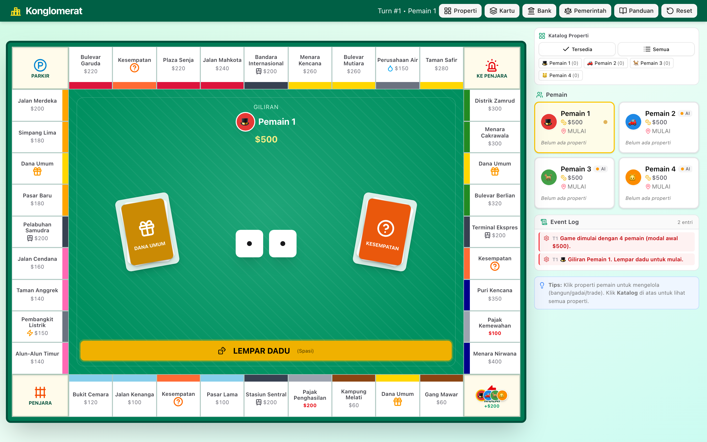
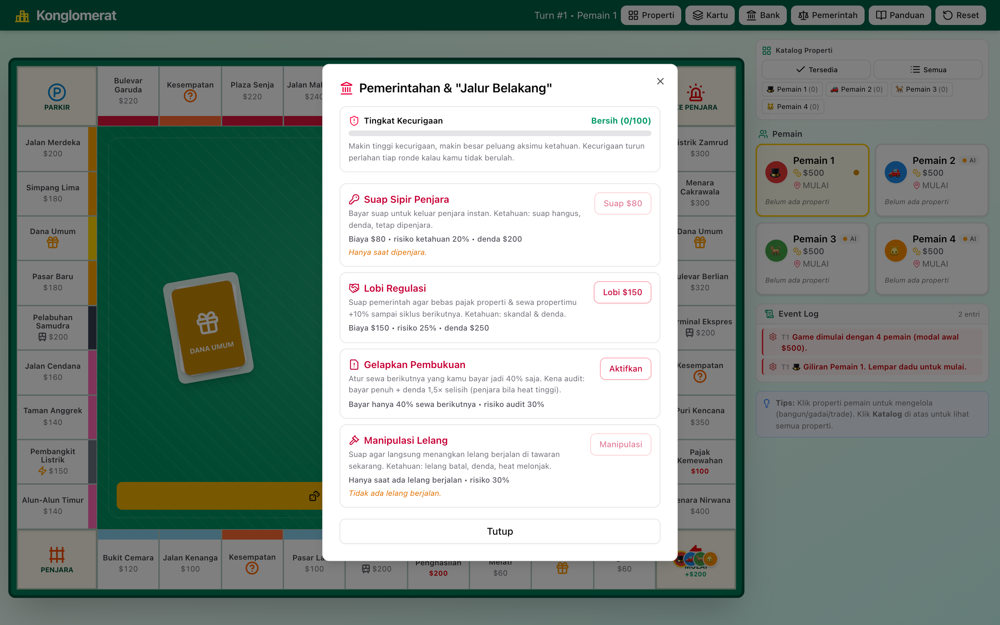

# Konglomerat

[](https://webgame.fachryxyf.com/konglomerat)
[](https://github.com/Fachryxyf/konglomerat/releases)
[](https://github.com/Fachryxyf/konglomerat/commits/main)
[](https://github.com/Fachryxyf/konglomerat/issues)
[](https://github.com/Fachryxyf/konglomerat)
[](#lisensi)

[](https://nextjs.org)
[](https://www.typescriptlang.org)
[](https://tailwindcss.com)
[](https://zustand-demo.pmnd.rs)
[](https://bun.sh)

> Bangun imperium properti & ekonomi di kota fiktif **Kota Raya**.


Permainan papan strategi ekonomi untuk **2–8 pemain** (campuran manusia & AI),
dengan ekonomi yang hidup: bank sentral, pinjaman berbunga, tahun fiskal,
pemerintahan & "jalur belakang" (suap/korupsi), hingga penyelamatan investor.
Dibangun dengan **Next.js 16 + TypeScript + Tailwind + Zustand**.

**Demo:** **https://webgame.fachryxyf.com/konglomerat**
**Status:** `v1.0.0-beta` — fitur lengkap, single-device (hotseat) vs AI.





<sub>Menu Pemerintahan & "jalur belakang" — suap, lobi, gelapkan pembukuan, manipulasi lelang — dengan meter kecurigaan (heat).</sub>

---

## Fitur

**Inti permainan**
- Papan 40 petak (8 grup warna, 4 transit, 2 utilitas, pajak, sudut), dadu 3D beranimasi, pion berjalan langkah-demi-langkah, aturan dadu kembar & penjara.
- Beli / lelang properti, sewa bertingkat dengan bonus monopoli, bangun rumah/hotel (aturan merata), gadai, jual ke bank, dan trade antar pemain.
- 3 tingkat **AI** (Mudah / Menengah / Sulit) dengan strategi beli, lelang, bangun, gadai & trade yang berbeda; AI bisa bertransaksi antar sesama AI.

**Sistem ekonomi**
- **Bank & pinjaman** — pinjam dengan tenor & bunga mengambang (ikut suku bunga acuan), plafon kredit berbasis kekayaan, cicilan otomatis, pelunasan dini.
- **Tahun Fiskal & kebijakan moneter otonom** — tiap ~12 ronde bank sentral & pemerintah menyetel suku bunga + regulasi (kontrol sewa, pajak properti) sesuai iklim ekonomi.
- **Pemerintahan & "cara curang"** — suap sipir, lobi regulasi, gelapkan pembukuan, manipulasi lelang. Tiap aksi punya **tingkat kecurigaan (heat)**; makin sering & ceroboh, makin besar risiko denda/pidana.
- **Penjara berdampak** — jaminan naik bertahap & ikut kekayaan, sewa anjlok saat dipenjara, aktivitas dibekukan, plus catatan kriminal.
- **Bangkrut & penyelamatan investor** — pakta bagi-hasil sewa sampai modal investor kembali 1,5×.
- Event acak berperingkat (Reguler → Mythos), kartu **Kesempatan** & **Dana Umum**.

**Lain-lain**
- Buku panduan lengkap dalam game, katalog properti & kartu, simpan-otomatis (resume setelah refresh), kontrol keyboard (Spasi).

## Teknologi

| | |
|---|---|
| Framework | Next.js 16 (App Router, output `standalone`) |
| Bahasa | TypeScript |
| State | Zustand (+ `persist`, penyimpanan ter-debounce) |
| UI | Tailwind CSS, Radix UI, lucide-react |
| Validasi | Zod |
| Runtime/PM | Bun |

## Arsitektur (ringkas)

- **Engine terisolasi** di `src/lib/monopoly/` — modul pure (`bank.ts`, `government.ts`, `ai.ts`, `events.ts`, `fiscal.ts`, `utils.ts`) + store Zustand (`gameStore.ts`).
- **Lapisan keamanan (siap server-authoritative):** RNG yang dapat di-seed (`rng.ts`), kosakata `Intent` (`intents.ts`), validasi berlapis `parseIntent` (zod) → `validateIntent` (aturan) → `checkInvariants`, semuanya lewat satu gerbang `dispatch`.
- Rencana keamanan & jalur multiplayer didokumentasikan di [`docs/SECURITY_AND_MULTIPLAYER_PLAN.md`](docs/SECURITY_AND_MULTIPLAYER_PLAN.md) dan [`docs/LAUNCH_ROADMAP.md`](docs/LAUNCH_ROADMAP.md).

## Menjalankan lokal

```bash
# prasyarat: Bun (https://bun.sh)
bun install
bun run dev          # http://localhost:3737
```

Build & jalankan produksi:

```bash
bun run build        # next build (standalone) + salin static/public
bun run start        # serve di port 3737
```

> Desktop-only by design — papan butuh layar lebar; di layar kecil tampil halaman peringatan.

## Deploy

Panduan deploy ke VM (mis. Google Cloud, Debian) — reverse proxy Caddy + HTTPS
otomatis + systemd — ada di **[`docs/DEPLOY.md`](docs/DEPLOY.md)**, lengkap dengan
`deploy/Caddyfile`, `deploy/konglomerat.service`, dan `deploy/deploy.sh`.

## Roadmap

`v1` beta sekarang: single-device vs AI. Berikutnya (lihat [LAUNCH_ROADMAP](docs/LAUNCH_ROADMAP.md)):
multiplayer real-time (server-authoritative + WebSocket + Redis), akun & match history, mobile responsif.

## Lisensi

© 2026 Fachry Fauzan Syafei. Hak cipta dilindungi (proprietary). Nama, desain
papan, dan teks adalah karya orisinal — **bukan** afiliasi/produk Hasbro. Mekanik
permainan papan bersifat umum dan tidak diklaim sebagai hak eksklusif.
